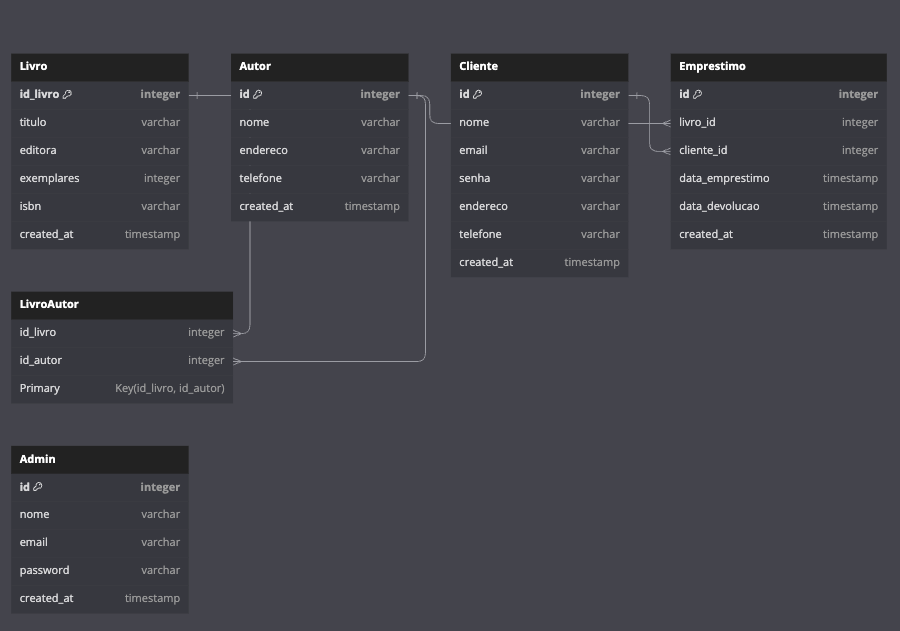

# Sistema de Gerenciamento de Biblioteca ( v1.0.0)

## 1. Introdução e Objetivos do projeto

Este projeto tem como objetivo a criação de um sistema de gerenciamento de biblioteca, com foco na eficiência do armazenamento e recuperação de informações sobre livros, autores, clientes e empréstimos. Através desse sistema, é possível gerenciar um ambiente de biblioteca de forma simples e eficaz, potencializando as operações de empréstimo de livros e a administração de seus registros.

## 2. Execução do programa

Para executar este projeto localmente, siga as etapas abaixo:

1. Clone este repositório para a sua máquina local.
2. Navegue até o diretório do projeto no terminal.
3. Execute `bundle install` para instalar todas as dependências necessárias.
4. Execute `rails db:migrate` para executar as migrações e criar o banco de dados.
5. Execute `rails db:seed` para preencher o banco de dados com dados iniciais.
6. Finalmente, execute `rails s` para iniciar o servidor e acessar o projeto em `http://localhost:3000/blazer`para realizar as consultas SQL e testar as relações.

## 3. Bibliotecas Utilizadas

O projeto foi construído utilizando as seguintes bibliotecas:

- Rails 7: Framework para desenvolvimento web utilizado para criar a aplicação.
- SQLite3: Banco de dados utilizado para o armazenamento de dados.
- Devise: Gem utilizada para o controle de sessão.
- Blazer: Gem utilizada para a visualização de consultas SQL.

## 4. Estrutura do Banco de Dados

O banco de dados é composto pelas entidades: Livro, Autor, Cliente e Empréstimo, cada um com seus respectivos atributos. Há uma relação de muitos para muitos (M:N) entre as entidades Livro e Autor, representada através de uma tabela adicional chamada "LivroAutor". A entidade Empréstimo possui uma relação de um para muitos (1:N) com a entidade Cliente. Diagrama do banco de dados e esquema podem ser encontrados nos links abaixo:

- [Link para o Diagrama](https://dbdiagram.io/d/64b6960902bd1c4a5e470156)
    
    
    

## 5. Conclusão e Considerações Finais

O Sistema de Gerenciamento de Biblioteca foi desenvolvido com o objetivo de proporcionar uma maneira eficiente de gerenciar os livros, autores, clientes e empréstimos de uma biblioteca. Através desse sistema, é possível manter todas as informações necessárias organizadas e facilmente acessíveis.

Embora o sistema cumpra com o objetivo proposto, há espaço para melhorias e refinamentos. Entre os pontos de melhoria identificados estão a utilização da gem 'bcrypt' para maior segurança no armazenamento de senhas, a criação de uma tabela adicional para 'Editoras' e a utilização da funcionalidade `has_and_belongs_to_many` do Rails para simplificar a manipulação de relações entre Livros e Autores.

Este projeto é uma prova do poder e da flexibilidade do Rails, demonstrando como é possível criar um sistema de gerenciamento de biblioteca robusto e eficiente com esse framework.

## 5. Próximos Updates:

- [ ]  Criar uma view para os listar todos os livros
- [ ]  Sistema de Login para Clientes e Admin.
- [ ]  Implementar Home's para o Cliente e Admin.
- [ ]  Criar uma rota para o Admin gerenciar os Emprestimos.
- [ ]  Permitir que o Admin insira livros e publique.
- [ ]  Acrescentar atributos como Descricacao, Imagem e Pdf para o Livro.
- [ ]  Preparar um MVP para Deploy.
- [ ]  ….

---

